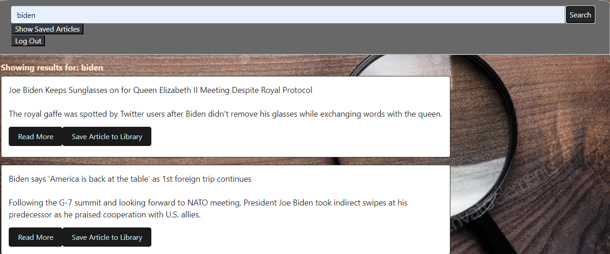

# Project2_News
## About
This program searches for news for a particuler topic using rapidapi api. It gather up to 10 articles. Interesting articles can then be saved
to the users account, which is created at login.
## Usage
Sequelize, Handlebars, Express, API's

## Contributions
This program was made by Bob Rossman, Ryan Mann and Thomas Kuntz
## License 
MIT

## Deployed App
https://warm-mesa-14576.herokuapp.com

